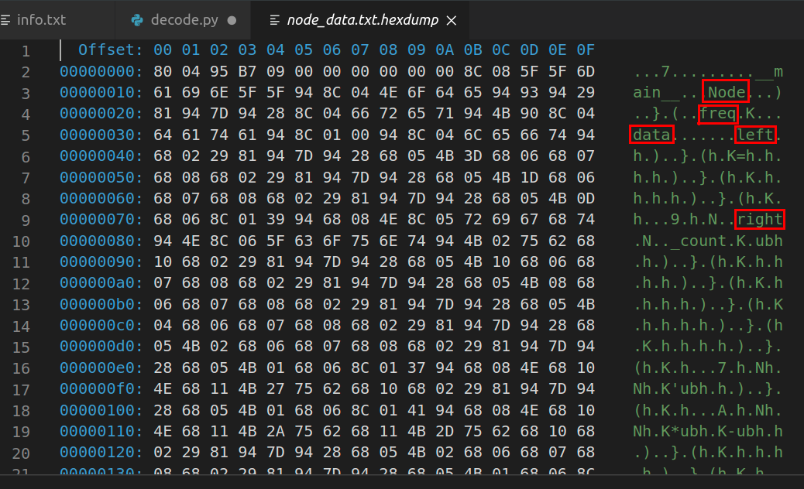
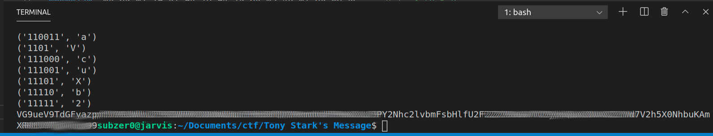

# Tony Stark's Message

 ### Step 1:
info.txt contains some encoded data and a link. The link should be used to download a file named **node_data.txt**
The states that the message is compressed and that node_data is pickled.

### Step 2: 
hexdumping node_data.txt shows us that there is a class with the name **Node** and there are some other variables in the class namely: **left**, **right**, **freq** and **data**. A variable named **_count** was also found but the use for it remains unknown. 
From this it seems to be clear that the compression technique used here was Huffman Encoding. The object stored in node_data.txt ought to be the huffman encoding tree of the message.

### Step 3: Write a code to uncompress from huffman encoding
decode.py is the code that I had written to solve this CTF challenge

After multiple attempts to decode the huffman tree, I had written decode.py to solve the challenge. All the encodings for the characters in the message were stored in a list along with its encoding.

#### Explanation:

(lines 3-6): In order to view the contents of the pickled file, create a class named **Node** . 
(lines 13-26): Function **rec(node, i)** decodes the Huffman encoding tree. 
(line 31): load the object from node_data.txt 
(lines 38-46): parse through encoded data appending one bit at a time to check if it matches with any entry in the encoding table. 

The message was parsed and using the encoding table, encoded_data was decoded. Looking closely, the decoded message looked like base64 encoding.

cyberchef was used to convert the base64 encoded message to ascii. After decoding to ascii, the message contained the flag.
